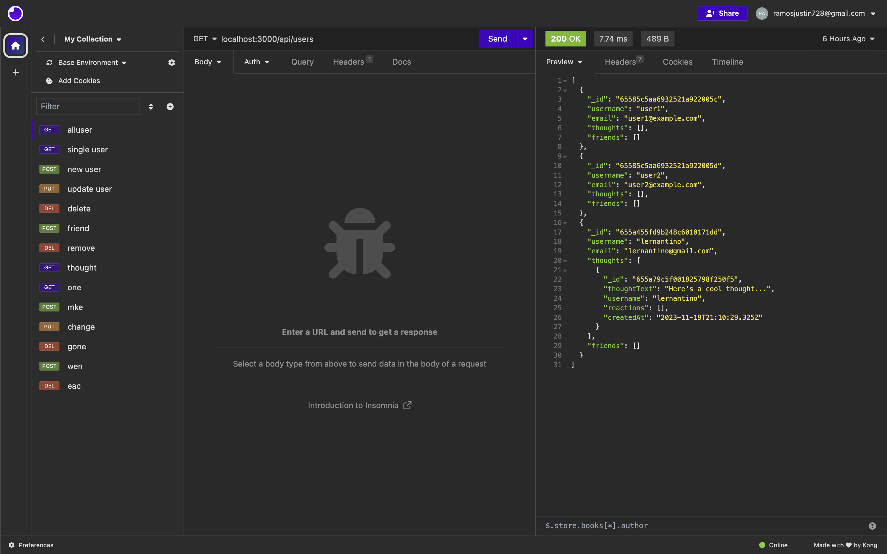
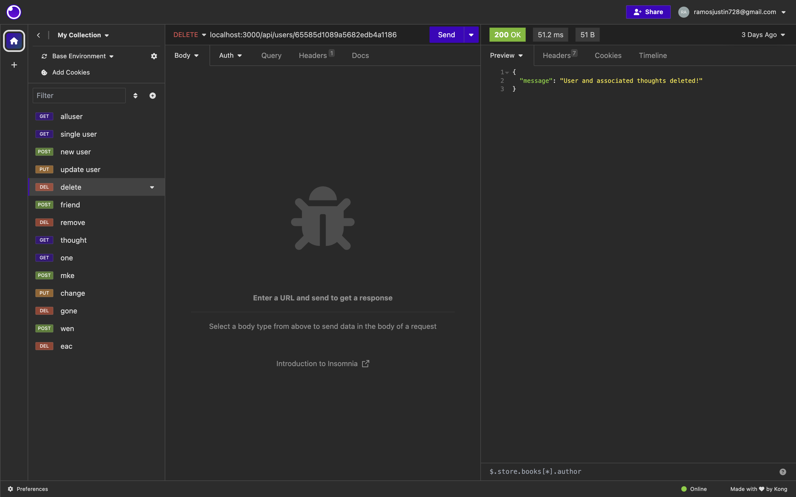
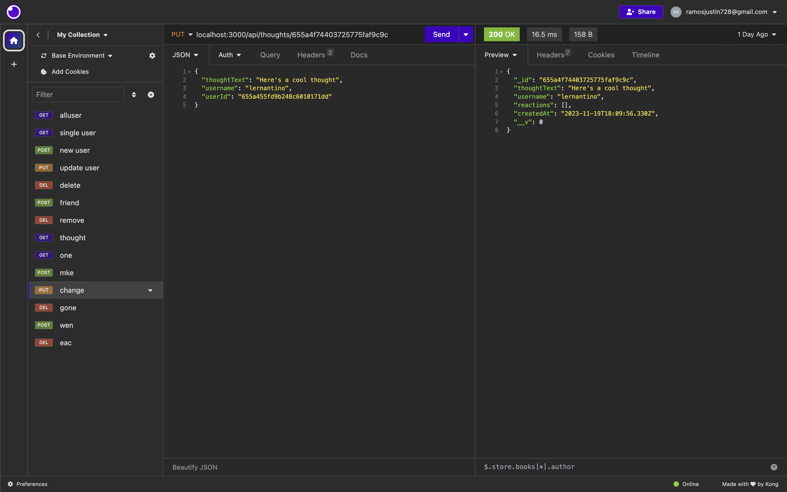
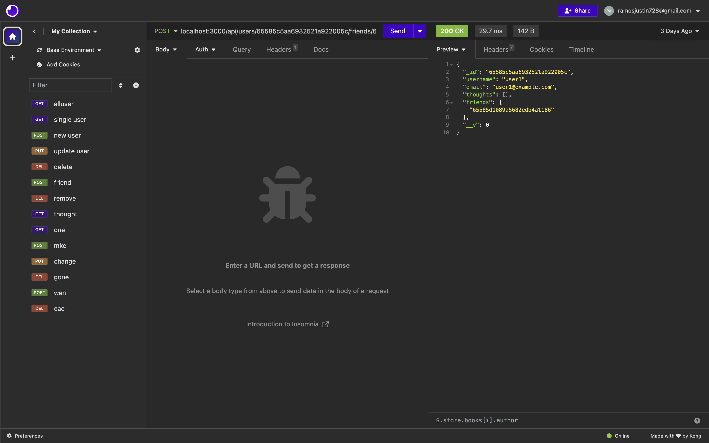
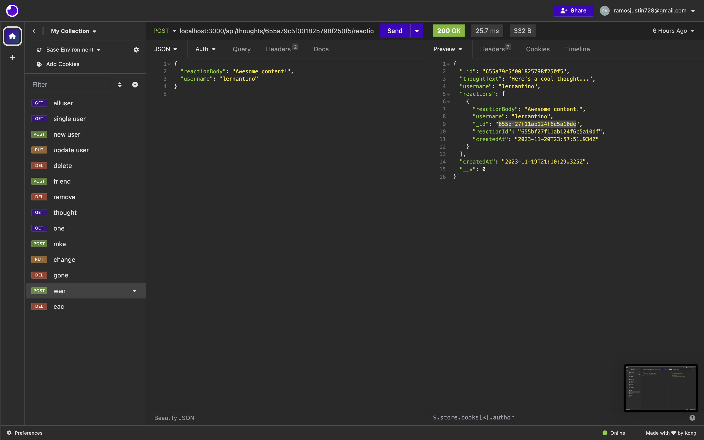

# express-mongoose-social-api

## Description
This is a mongoose application to use GET POST PUT DELETE routes in insomnia to get user thoughts post user thoughts friend reaction put user and thought delete user thought friend and reaction.

Walkthrough: hhttps://drive.google.com/file/d/1xDsuL9wtZqdUwlBFLsxLRJC_RAQpJTlX/view
## Usage
use npm install npm start npm seed
## Images

## Credits
Justin
## License
MIT